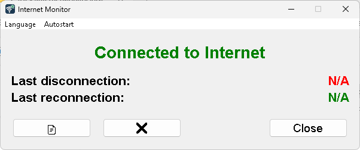

# Internet Monitor

Internet Monitor is a simple desktop application built with Python and Tkinter that monitors your internet connection status (up/down). It logs periods of disconnection and reconnection and displays the current status along with the times of the last disconnection and reconnection events.



## Features

*   **Real-time Status:** Shows whether you are currently connected to the internet or not.
*   **Event Logging:** Logs internet down and up events with timestamps to a local file (`internet_log.txt`).
*   **Last Event Display:** Displays the date and time of the last recorded internet disconnection and reconnection.
*   **Persistent History:** Loads the last known disconnection and reconnection times from the log file on startup.
*   **User-Friendly Interface:** Simple GUI that provides clear information at a glance.
*   **Manage Log File:** Includes a buttons to easily open and delete the `internet_log.txt` file directly from the application.
*   **Multi-language Support:** Supports multiple languages (currently English, German, Spanish, French, Italian, Japanese, Korean, Portuguese, Russian, Chinese and Arabic) with automatic detection of system language at startup.

## How to Run

There are three ways to run this application:

### 1. From Source Code

**Prerequisites:**
*   Python 3.x
*   Tkinter (usually included with Python standard library)

**Steps:**
1.  Clone this repository or download the source code.
2.  Navigate to the project directory in your terminal.
3.  Run the script:
    ```bash
    python internet_monitor.py
    ```

### 2. As an Executable (Windows)

An executable version (`internetm.exe`) can be built using PyInstaller. The `internetm.spec` file is provided for this purpose.

**To build the executable:**
1.  Ensure you have PyInstaller installed: `pip install pyinstaller`
2.  Navigate to the project directory.
3.  Run PyInstaller with the spec file:
    ```bash
    pyinstaller internetm.spec
    ```
4.  The executable will be located in the `dist` folder (`dist/internetm/internetm.exe` or `dist/internetm.exe`).

**Note:** A pre-built executable is also provided in the `dist` folder of this repository.

### 3. Using the Windows Installer

For the easiest installation experience, a Windows installer (`InternetMonitorSetup.exe`) is available in the `dist` folder of this repository.

**Steps:**
1.  Download the installer file.
2.  Double-click the installer to start the installation process.
3.  Follow the on-screen instructions:
    *   Select your preferred language for the installer
    *   Choose the installation location (default is Program Files)
    *   Decide whether to create a desktop shortcut
4.  After installation, you can launch Internet Monitor from:
    *   The desktop shortcut (if you chose to create one)
    *   The Start Menu under "Internet Monitor"

**Note:** The installer properly packages all required files, including the localization files for multi-language support.

## Dependencies

*   **Python 3.x**
*   **Tkinter:** For the graphical user interface. This is typically part of the Python standard library, so no separate installation is usually needed.
*   **JSON:** Used for storing language translation files.

## Localization

The application supports multiple languages with automatic detection of the system language at startup. Currently supported languages are:

* English (en)
* German (de)
* Spanish (es)
* French (fr)
* Italian (it)
* Japanese (ja)
* Korean (ko)
* Portuguese (pt)
* Russian (ru)
* Chinese (zh)
* Arabic (ar)

### Adding a New Language

To add a new language to the application:

1. Create a new JSON file in the `locales` directory with the language code as the filename (e.g., `fr.json` for French)
2. Copy the structure from an existing language file (e.g., `en.json`)
3. Translate all the string values to the new language

The application will automatically detect the new language file and add it to the available languages list. No code changes are required.

## Logging

*   Connection events (DOWN, UP) are logged to `internet_log.txt` in the same directory as the application.
*   Each log entry includes a timestamp and the event type.
    Example: `YYYY/MM/DD HH:MM - DOWN`

## Icon

The application uses `internet-monitor.ico` as its icon, located in the `icon` directory.

## License

This project is licensed under the MIT License - see the [LICENSE](LICENSE) file for details.